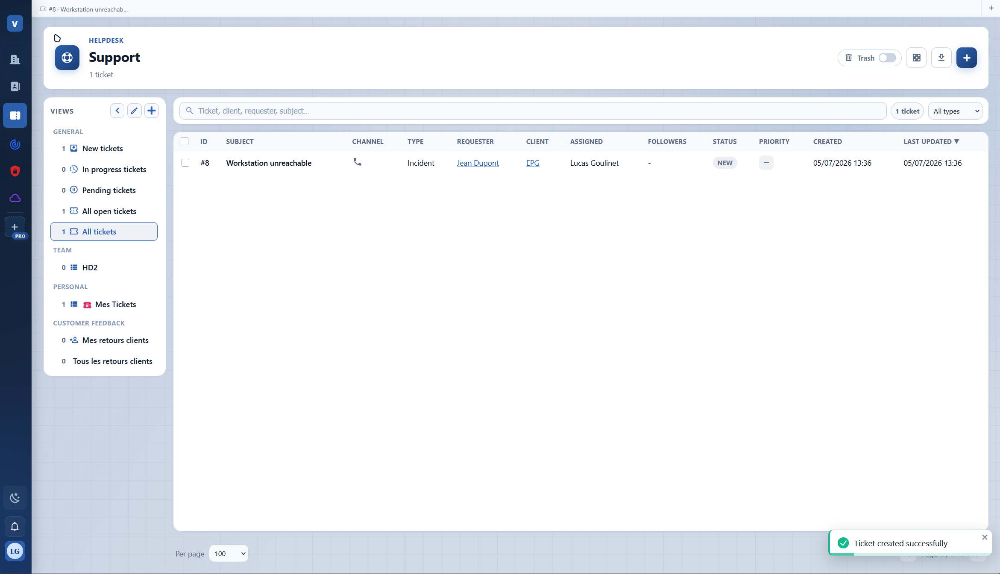
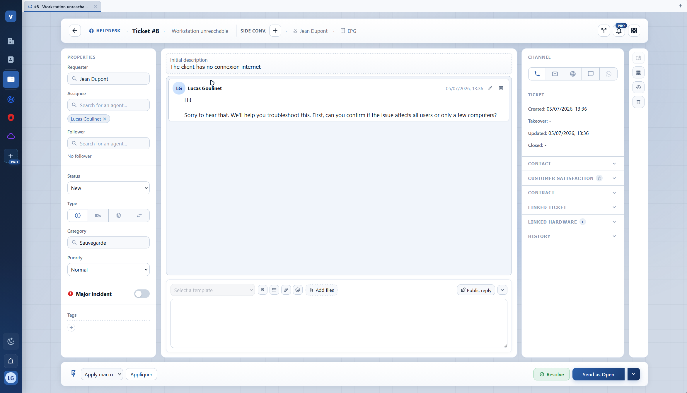
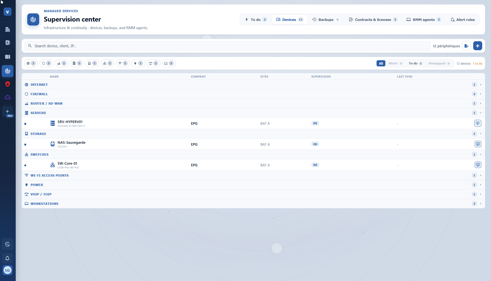
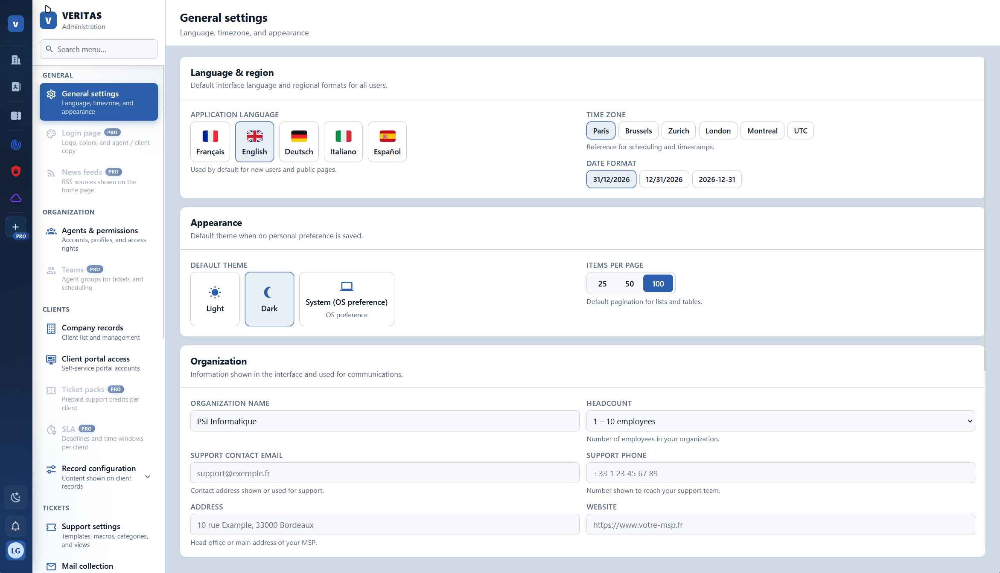
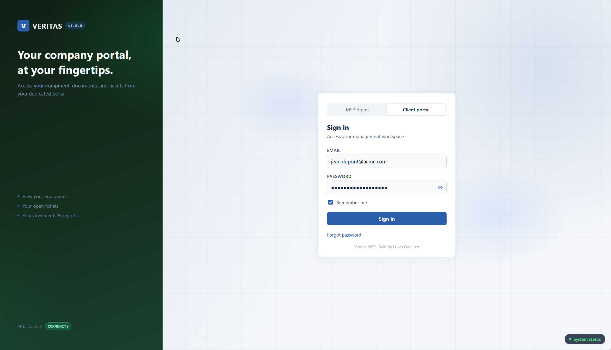

<p align="center">
  
</p>

<p align="center">
  <strong>Self-hosted MSP platform combining PSA, ITSM, and RMM in one place.</strong>
</p>

<p align="center">
  <a href="https://veritas-msp.com">Website</a> ·
  <a href="./EDITIONS.md">Editions</a> ·
  <a href="https://github.com/veritas-msp">GitHub Organization</a>
</p>

<p align="center">
  
  
  
</p>

---

## Overview

**Veritas** centralizes day-to-day MSP operations: companies and contacts (PSA), support tickets (ITSM), infrastructure supervision, and RMM. Everything runs on your own infrastructure.

| Component | Repository |
|-----------|------------|
| API & database | [veritas-backend](https://github.com/veritas-msp/veritas-backend) |
| Web UI | [veritas-frontend](https://github.com/veritas-msp/veritas-frontend) |
| Windows RMM agent | [veritas-agent](https://github.com/veritas-msp/veritas-agent) |

Clone this meta repo and the application repos **side by side** in the same directory.

## Screenshots

### Helpdesk

Ticket views, filters, and assignment for your support team.

<p align="center">
  
</p>

### Ticket workspace

Full ticket detail: conversation thread, properties, linked hardware, and resolution workflow.

<p align="center">
  
</p>

### Supervision center

Infrastructure inventory by site and device type, including servers, storage, network, workstations, and RMM agents.

<p align="center">
  
</p>

### Administration

Language, timezone, appearance, and organization settings from a single admin area.

<p align="center">
  
</p>

### Client portal

Dedicated sign-in for end users: equipment, documents, and tickets from their company portal.

<p align="center">
  
</p>

---

## Requirements

| Method | What you need |
|--------|----------------|
| **Docker** | [Docker Desktop](https://www.docker.com/products/docker-desktop/) or Docker Engine + Compose v2 |
| **From source** | Node.js 20+, PostgreSQL 15+, npm, Git |

Application repositories (`veritas-backend`, `veritas-frontend`) must sit **next to** this meta repo in the same parent folder. Docker Compose builds them from `./veritas-backend` and `./veritas-frontend`.

## Quick start

Pick one deployment path below. Both end at the same setup wizard: http://localhost:3000/setup

### Option A: Docker

Best for a quick production-like install on a single machine.

**1. Clone the repositories**

```bash
mkdir veritas && cd veritas
git clone https://github.com/veritas-msp/veritas.git .
git clone https://github.com/veritas-msp/veritas-backend.git veritas-backend
git clone https://github.com/veritas-msp/veritas-frontend.git veritas-frontend
```

**2. Configure secrets**

```bash
cp .env.docker.example .env
```

Edit `.env` and set `JWT_SECRET` and `ENCRYPTION_KEY` (64 random characters each). On PowerShell:

```powershell
-join ((48..57 + 65..90 + 97..122 | Get-Random -Count 64 | ForEach-Object {[char]$_}))
```

**3. Start the stack**

```bash
docker compose up -d --build
```

**4. Finish setup**

1. Open http://localhost:3000/setup, run migrations, and create the admin account  
2. Sign in at http://localhost:3000/login

| Service | URL |
|---------|-----|
| Web UI | http://localhost:3000 |
| API (direct) | http://localhost:3001 |

Data is stored in Docker volumes `veritas-db` and `veritas-uploads`.

### Option B: From source (GitHub clone)

Best for local development with hot reload.

**1. Clone the repositories**

```bash
mkdir veritas && cd veritas
git clone https://github.com/veritas-msp/veritas.git .
git clone https://github.com/veritas-msp/veritas-backend.git veritas-backend
git clone https://github.com/veritas-msp/veritas-frontend.git veritas-frontend
```

Optional: [veritas-agent](https://github.com/veritas-msp/veritas-agent) for Windows RMM endpoints.

**2. PostgreSQL**

Create an empty database (PostgreSQL 15+). You can leave `DATABASE_URL` empty on first run; the setup wizard will configure it.

**3. Backend**

```bash
cd veritas-backend
cp .env.example .env
npm install
npm start
```

**4. Frontend** (new terminal)

```bash
cd veritas-frontend
cp .env.example .env
npm install
npm start
```

**5. Finish setup**

1. Open http://localhost:3000/setup, run migrations, and create the admin account  
2. Sign in at http://localhost:3000/login

#### Environment variables (from source)

Set in `veritas-backend/.env`:

| Variable | Description |
|----------|-------------|
| `JWT_SECRET` | Session signing secret |
| `ENCRYPTION_KEY` | Encryption key for sensitive data |
| `DATABASE_URL` | PostgreSQL connection string (optional until `/setup`) |
| `VERITAS_EDITION` | `community` (default) or `pro` |

Set in `veritas-frontend/.env`:

| Variable | Description |
|----------|-------------|
| `REACT_APP_API_BASE_URL` | Backend URL without `/api` (default `http://localhost:3001`) |
| `REACT_APP_VERITAS_EDITION` | `community` (default) or `pro` |

## Services (from source)

| Service | Port | Role |
|---------|------|------|
| Frontend | 3000 | Web UI + `/api` proxy |
| Backend | 3001 | REST API |
| PostgreSQL | 5432 | Database |

## Production

Set public URLs in backend and frontend `.env` files, then put a reverse proxy (nginx, Traefik, Caddy, …) in front of port 3000 for TLS. See each application repo for deployment details.

## Editions

Community and Pro differ in modules and quotas (companies, contacts, agents, RMM endpoints, etc.). Details: [EDITIONS.md](./EDITIONS.md).

## License

[GNU Affero General Public License v3.0](./LICENSE)

<p align="center">
  
</p>
