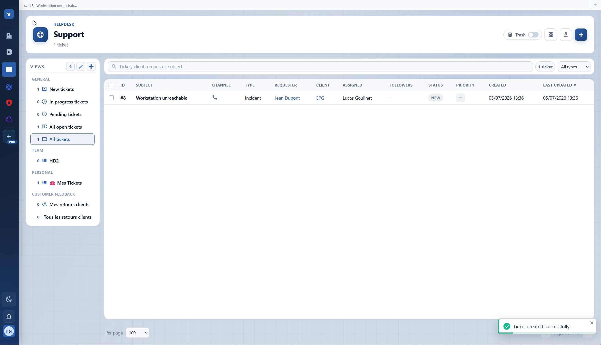
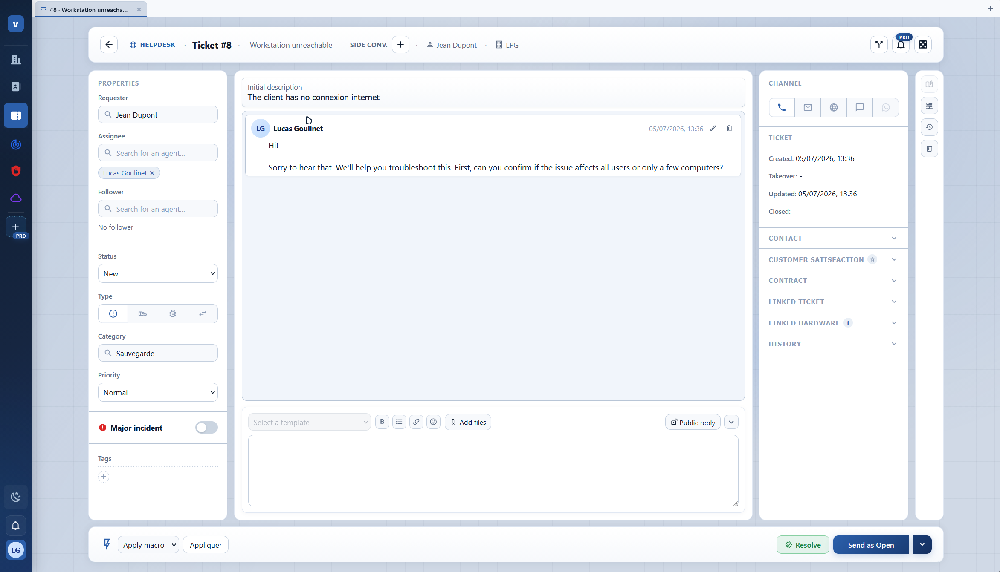
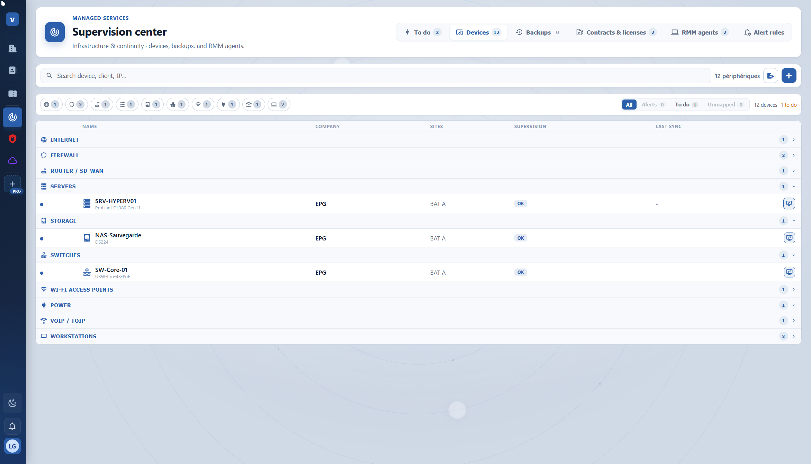
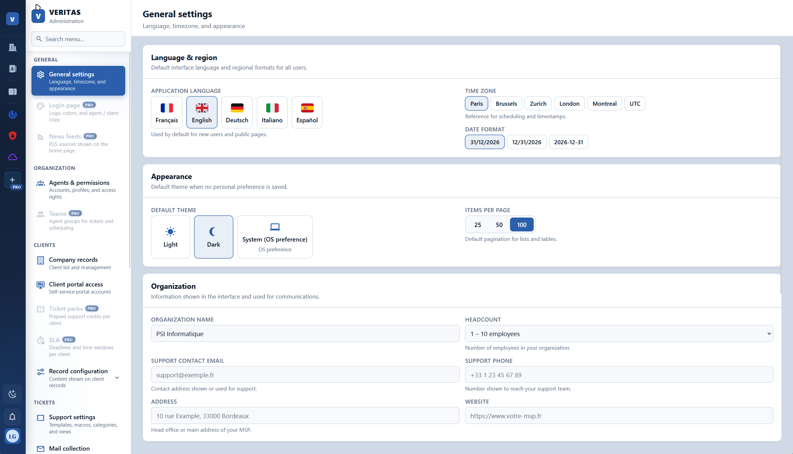
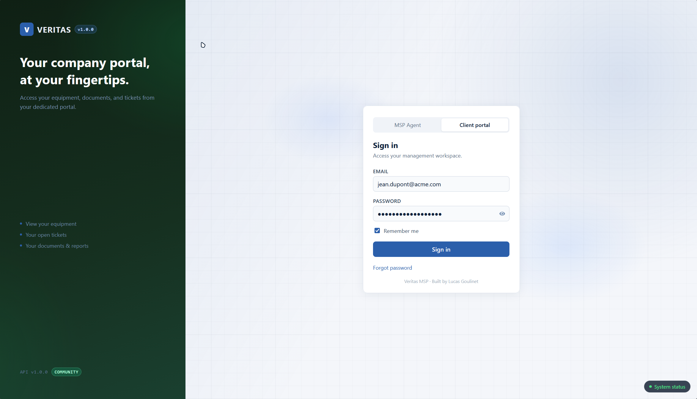

<p align="center">
  
</p>

<p align="center">
  <strong>Self-hosted MSP platform combining PSA, ITSM, and RMM in one place.</strong>
</p>

<p align="center">
  <a href="https://veritas-msp.com">Website</a> ·
  <a href="./EDITIONS.md">Editions</a> ·
  <a href="https://github.com/veritas-msp">GitHub Organization</a>
</p>

<p align="center">
  
  
  
</p>

---

## Overview

**Veritas** centralizes day-to-day MSP operations: companies and contacts (PSA), support tickets (ITSM), infrastructure supervision, and RMM. Everything runs on your own infrastructure.

| Component | Path |
|-----------|------|
| API & database | `veritas/backend` |
| Web UI | `veritas/frontend` |
| Windows RMM agent | `veritas/RMM/Agents/windows` |

This repository is a monorepo: clone once, then run with Docker or from source.

## Screenshots

### Helpdesk

Ticket views, filters, and assignment for your support team.

<p align="center">
  
</p>

### Ticket workspace

Full ticket detail: conversation thread, properties, linked hardware, and resolution workflow.

<p align="center">
  
</p>

### Supervision center

Infrastructure inventory by site and device type, including servers, storage, network, workstations, and RMM agents.

<p align="center">
  
</p>

### Administration

Language, timezone, appearance, and organization settings from a single admin area.

<p align="center">
  
</p>

### Client portal

Dedicated sign-in for end users: equipment, documents, and tickets from their company portal.

<p align="center">
  
</p>

---

## Requirements

| Method | What you need |
|--------|----------------|
| **Docker** | [Docker Desktop](https://www.docker.com/products/docker-desktop/) or Docker Engine + Compose v2 |
| **From source** | Node.js 20+, PostgreSQL 15+, npm, Git |

Docker Compose builds from `./veritas/backend` and `./veritas/frontend`.

## Quick start

Pick one deployment path below. Both end at the same setup wizard: http://localhost:3000/setup

### Option A: Docker

Best for a quick production-like install on a single machine.

**1. Clone the repository**

```bash
git clone https://github.com/veritas-msp/veritas.git
cd veritas
```

**2. Prepare `.env` (generates secrets)**

```bash
# Linux / macOS
chmod +x scripts/prepare-docker-env.sh && ./scripts/prepare-docker-env.sh
```

```powershell
# Windows PowerShell
powershell -ExecutionPolicy Bypass -File .\scripts\prepare-docker-env.ps1
```

Or copy `.env.docker.example` to `.env` and set `JWT_SECRET` / `ENCRYPTION_KEY` yourself (non-empty required).

**3. Start the stack**

```bash
docker compose up -d --build
```

**4. Finish setup**

1. Open http://localhost:3000/setup, run migrations, and create the admin account  
2. Sign in at http://localhost:3000/login

| Service | URL |
|---------|-----|
| Web UI | http://localhost:3000 |
| API (direct) | http://localhost:3001 |

Data is stored in Docker volumes `veritas-db` and `veritas-uploads`.

**Small VPS:** the frontend image build needs about **2 GB free RAM** (or swap). Source maps are disabled in Docker. If you hit `JavaScript heap out of memory`, add swap (1–2 GB) or set in `.env`:

```bash
NODE_MAX_OLD_SPACE_SIZE=2048
```

Then rebuild: `docker compose build --no-cache veritas-frontend && docker compose up -d`. On 1 GB hosts, build the images on a larger machine (or CI) and deploy with `docker compose up -d` only.

### Option B: From source

Best for local development with hot reload.

**1. Clone and install**

```bash
git clone https://github.com/veritas-msp/veritas.git
cd veritas/veritas
cp backend/.env.example backend/.env
cp frontend/.env.example frontend/.env
npm run install:all
```

**2. PostgreSQL**

Create an empty database (PostgreSQL 15+). You can leave `DATABASE_URL` empty on first run; the setup wizard will configure it.

**3. Run backend + frontend**

```bash
npm run dev
```

Or in two terminals:

```bash
npm run dev:api
npm run dev:ui
```

**4. Finish setup**

1. Open http://localhost:3000/setup, run migrations, and create the admin account  
2. Sign in at http://localhost:3000/login

#### Environment variables (from source)

Set in `veritas/backend/.env`:

| Variable | Description |
|----------|-------------|
| `JWT_SECRET` | Session signing secret |
| `ENCRYPTION_KEY` | Encryption key for sensitive data |
| `DATABASE_URL` | PostgreSQL connection string (optional until `/setup`) |
| `VERITAS_EDITION` | `community` (default) or `pro` |

Set in `veritas/frontend/.env`:

| Variable | Description |
|----------|-------------|
| `REACT_APP_API_BASE_URL` | Backend URL without `/api` (default `http://localhost:3001`) |
| `REACT_APP_VERITAS_EDITION` | `community` (default) or `pro` |

## Services (from source)

| Service | Port | Role |
|---------|------|------|
| Frontend | 3000 | Web UI + `/api` proxy |
| Backend | 3001 | REST API |
| PostgreSQL | 5432 | Database |

## Production

Set public URLs in backend and frontend `.env` files, then put a reverse proxy (nginx, Traefik, Caddy, …) in front of port 3000 for TLS.

## Editions

Community and Pro differ in modules and quotas (companies, contacts, agents, RMM endpoints, etc.). Details: [EDITIONS.md](./EDITIONS.md).

## License

[GNU Affero General Public License v3.0](./LICENSE)

<p align="center">
  
</p>
